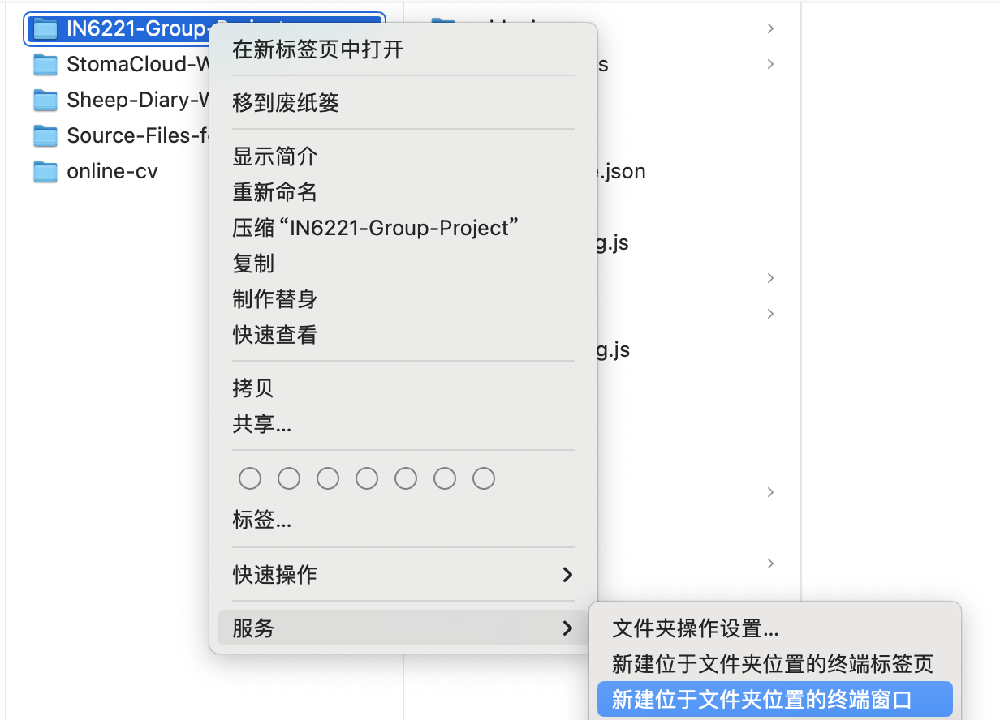
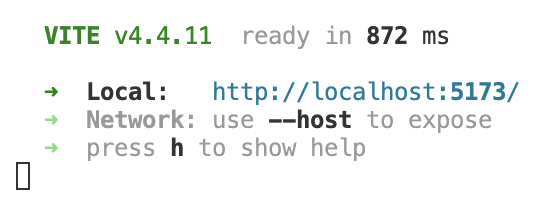

# Vue 3 + TypeScript + Vite

This template should help get you started developing with Vue 3 and TypeScript in Vite. The template uses Vue 3 `<script setup>` SFCs, check out the [script setup docs](https://v3.vuejs.org/api/sfc-script-setup.html#sfc-script-setup) to learn more.

## Recommended IDE Setup

- [VS Code](https://code.visualstudio.com/) + [Volar](https://marketplace.visualstudio.com/items?itemName=Vue.volar) (and disable Vetur) + [TypeScript Vue Plugin (Volar)](https://marketplace.visualstudio.com/items?itemName=Vue.vscode-typescript-vue-plugin) + [Tailwind Intellesense](https://marketplace.visualstudio.com/items?itemName=bradlc.vscode-tailwindcss)（自动补全）.


## Type Support For `.vue` Imports in TS

TypeScript cannot handle type information for `.vue` imports by default, so we replace the `tsc` CLI with `vue-tsc` for type checking. In editors, we need [TypeScript Vue Plugin (Volar)](https://marketplace.visualstudio.com/items?itemName=Vue.vscode-typescript-vue-plugin) to make the TypeScript language service aware of `.vue` types.

If the standalone TypeScript plugin doesn't feel fast enough to you, Volar has also implemented a [Take Over Mode](https://github.com/johnsoncodehk/volar/discussions/471#discussioncomment-1361669) that is more performant. You can enable it by the following steps:

1. Disable the built-in TypeScript Extension
   1. Run `Extensions: Show Built-in Extensions` from VSCode's command palette
   2. Find `TypeScript and JavaScript Language Features`, right click and select `Disable (Workspace)`
2. Reload the VSCode window by running `Developer: Reload Window` from the command palette.

## 配环境（for Mac）

### 1. 装各种包管理器
如果你没装过homebrew, node(npm)和yarn：

（装过了就看下面的2吧）
#### Homebrew
打开终端，贴上：

```sh
/bin/bash -c "$(curl -fsSL https://raw.githubusercontent.com/Homebrew/install/HEAD/install.sh)"
```

安装完成后重启终端，敲个：
```sh
brew --version
```
显示Homebrew+版本号，没有报错就可
如果有出现fatal啥啥啥：

```sh
git config --global --add safe.directory /opt/homebrew/Library/Taps/homebrew/homebrew-core
git config --global --add safe.directory /opt/homebrew/Library/Taps/homebrew/homebrew-cask
```
应该就行了
#### Node
终端敲：
```sh
brew install node
```
装完后重启终端，然后敲：
```sh
npde -v
```
和
```sh
npm -v
```
都出现版本号，没报错即可。

#### Yarn
终端敲：
```sh
npm install -g yarn
```
安装完重启终端后敲：
```sh
yarn -v
```
出现版本号就没问题

### 2. 正式开始配环境
右键点击这个文件夹，在“服务”中找到和终端有关的那俩，随便点一个都行



也有可能不在“服务”里，直接右键就有

*（至今没弄懂为什么有的mac右键直接就有，有的在服务里）*

打开终端后敲：
```sh
yarn
```
装完后再敲：
```sh
yarn add @types/d3 
```
至此，环境就配好了

## 打开页面
可以在vscode的终端里敲
```sh
yarn dev
```



按住Command，戳那个蓝蓝的链接


🎉